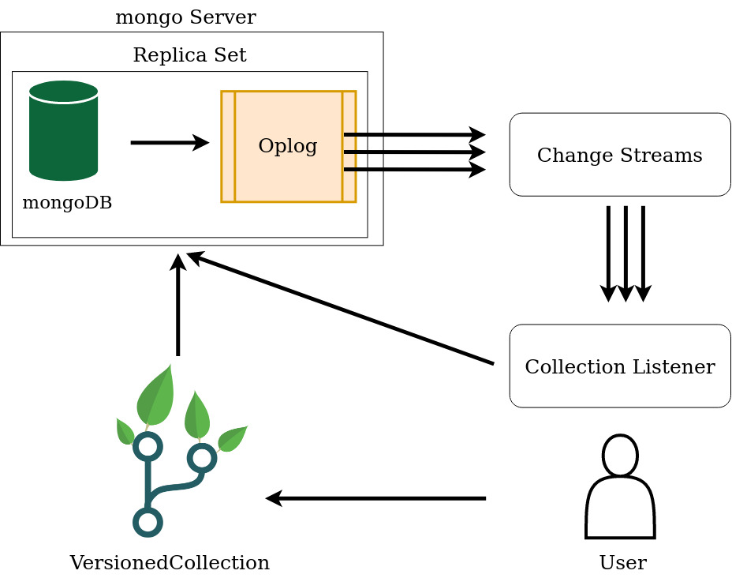
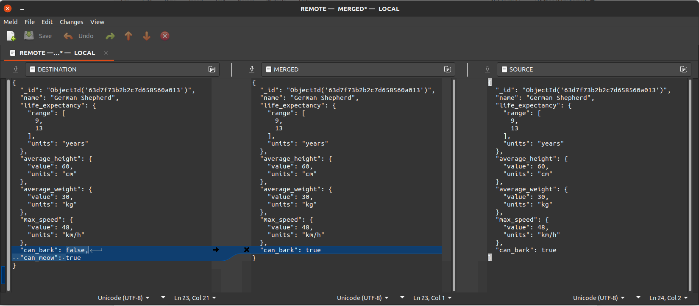

.. _implementation-details-doc:

Implementation details
========================
.. currentmodule:: versioned_collection

This document aims at giving a more in-depth explanation of the internal
structure of a :class:`VersionedCollection` class and how the versioning works.
A :class:`VersionedCollection` extends a pymongo
`Collection <https://pymongo.readthedocs.io/en/stable/api/pymongo/collection.html#pymongo.collection.Collection>`_
to be able to interact with a mongo server and adds versioning features to it.

.. contents:: Contents

Top level architecture
-------------------------
From the top-level, when a ``VersionedCollection`` object it created, two
things happen:

  1. A connection to the mongo server is opened by the ``VersionedCollection``
     to allow to interact with the target collection from the database.
  2. A listener process is launched and records the IDs of all the modified
     documents in the target collection. This happens in parallel, and
     changes are almost instantaneously detected and recorded.

.. _overall-architecture:

           to the changes made to the collection by using database change
           streams. The change streams read the mongoDB Oplog. To enable change
           streams, the mongo server has to have replica sets enabled.

    Overall architecture.

:numref:`overall-architecture` shows the high-level architecture. The
mongo server has to run a replica set, to enable the Oplog. The Oplog is
mongoDB's mechanism of replicating databases: the primary database records all
the operations performed on it to the Oplog, which is then used by the
secondary databases to become (eventually) consistent with the primary database.
Having the operations log enabled, we can make use the MongoDB Change Streams.

The Change Streams are MongoDB's way of allowing users to access real-time data
by watching a collection and triggering event notifications when a certain
event occurred.
The :class:`~versioned_collection.listener.CollectionListener` uses them
to get the changes made to the tracked collection and record the IDs of the
modified documents in an auxiliary collection.

The Collection Listener
++++++++++++++++++++++++
This module listens to the Change Streams, takes the IDs of the modified
docments and stores them into an auxiliary collection used to mark the target
documents as modified. This information will be useful in various scenarios,
such as when a new version is registered.
If the documents in the target collection are modified and then
updated back to their original state, then they are still marked as modified,
but when a new version will be registered they will be ignored as they are
detected to have no changes.

An important observation about this module is that it requires some level of
synchronisation with the ``VersionedCollection`` module to make sure that all
changes to the target collection are correctly processed under all possible
circumstances. The above mentioned Change Streams are eventually consistent
(actually their consistency level is higher than that),
so the ``CollectionListener`` automatically becomes eventually consistent, which
is not desired. We cannot partially register a version of a collection therefore
we have to make sure that all the modified documents between two `register`
operations are recorded as part of the new version. This requires the main
thread to wait for the listener to process all the changes before moving on.
This is usually a matter of milliseconds after a versioning operations such
as `register` or `checkout` is invoked.

A closer look to the database
------------------------------
``versioned_collection`` uses MongoDB itself to keep track of the versioning
information. The additional helper collections are created on the same
database where the versioned collection is located. There are six new
collections created for each new versioned collection and one additional
collection per database. The names of the collections start with a double
underscore, the convention being
``__<helper_collection_name>_<target_collection_name>``.

The following table lists the helper or tracking collections created for a
target collection named ``coll`` (for the rest of the document we will use
this collection name in the examples and explanations):

.. _tracking-collections-table:
.. list-table:: Tracking collections
    :widths: 10 50
    :header-rows: 1

    * - Helper collection name
      - Role

    * - :ref:`__branches_coll <branches-collection>`
      - Each document holds information about a branch in the version tree.

    * - :ref:`__deltas_coll <deltas-collection>`
      -  Each document contains the `delta` used to transform a single document
         between two consecutive versions.

    * - :ref:`__log_coll <logs-collection>`
      -  Holds the data about each versioned registered, such as a timestamp,
         a message, to which version in the version tree it corresponds, etc.

    * - :ref:`__metadata_coll <metadata-collection>`
      -  Contains a single document tracking the current state (status) of the
         collection, such as the version the collection is currently checked
         out at, whether the collection has unregistered changes, whether the
         collection is in detached head mode, or if it has stashed changes or
         conflicts.

    * - :ref:`__modified_coll <modified-collection>`
      -  Contains the ids of the modified documents and the operation that
         modified a document.

    * - :ref:`__replica_coll <replica-collection>`
      -  Contains a full replica of a specific version of the target collection.

    * - :ref:`__stash_coll <stash-collection>` and `__stash_modified_collection`
      -  Two collections that store the modified documents, and their trackers.

    * - :ref:`__conflicts_coll <conflicts-collection>`:
      -  Contains one document for each document of the target collection that
         contains conflicts after a ``pull``.

    * - :ref:`__vc_lock <lock-collection>`
      -  Stores information used to lock a collection for versioning
         operations across processes.

Introduction to collection tracking
------------------------------------
In this section we are going to briefly discuss how each collection in
:numref:`tracking-collections-table` works and interacts with each other, and
in the next section we will take a closer look at the structure and the role
of each collection.

When a ``VersionedCollection`` object is created the first time for a
regular collection, most of the versioning functionality is not available,
because the collection is not initialised for versioning yet.
There are two scenarios when a collection can be initialised: when it is
empty, or when it already contains some documents, so the initial state of
the collection will contain all the documents that already exist in the
collection.
After initialisation and when loading an already tracked collection, a process
that listens to the changes made to the collection is started. The listener
uses the change streams o detect the events corresponding to the updates made
to the versioned collection and mark the documents for which the change
events were generated as modified. This is done by creating a new document
containing the ID of the modified document and the type of the operations that
modified it (insertion, deletion, update) and adding this document to the
``__modified_coll`` collection.

Versioning a collection means recording all the documents that were modified
between two versions and having a mechanism of transforming a document from
the state it was in one version to its state in the other version. One
trivial way of versioning a collection is making a backup for each version,
but this wastes a lot of storage space if the collection is large and only a
tiny change to a single document, let's say, was made between two versions.
The obvious and more efficient way of versioning is storing the differences
(`deltas`) between two versions of a document and having a way of applying
the delta both forward and backward to move the document from one state to
another. To do that, we have two options: each time a document of the target
collection is updated we compute the delta between its old and new state
after the update, and when we register a new version we compose all the
deltas and store them, or we make a copy of the target collection, we record
which documents were modified, and when we register a new version we just
grab the document from the replica collection and the document from the
target collection, compute the delta and record it. The first option makes
the versioning operations quicker since most of the work is already done, but
it slows down the basic interactions with the database, while the second
option requires more time to perform versioning operations, but it is as fast
as a regular pymongo collection. This library uses the second approach.

The replica collection is stored under ``__replica_coll`` and it is used
together with the ``__modified_coll`` to compute the deltas during version
registration, which are stored in the ``__deltas_coll`` collection. The
deltas are then used to check out different versions or branches, by
iteratively applying the required deltas on the modified documents to move
between versions.

The history of versions is recorded in the log tree, which is stored under
``__log_coll``. It is a tree because the collection can have branches, and
not a graph because the merging operations will not make a lot of sense in
most of the situations (or at least the situations we have developed this
library to help with).

The tracking collections
--------------------------

In this section we will briefly look at the role each helper collection
plays in collection versioning and examine the state of each collection while
modifying and running versioning operations on a target collection. In the
next sections we will explain how each piece of the puzzle presented
in this section come together.

To help better understanding the purpose of each collection, we'll create a
simple collection that will allow to inspect how the documents of the
tracking collection look and are used.

.. code-block:: python

    >>> from pymongo import MongoClient
    >>> from versioned_collection import VersionedCollection
    >>> client = MongoClient("mongodb://localhost:27017")
    >>> db = client['versioned_collection_test']
    >>> collection = VersionedCollection(database=db, name='dogs')
    >>> collection.init("Initial version")
    True

Modified documents
+++++++++++++++++++
This collection stores references to the documents of the tracked collection
that were modified or untracked, i.e., the newly added documents, so it
simply marks which documents require attention during the registering a new
version, for example.

Let's insert a document in our collection ``dogs`` and see how
``__modified_dogs`` is changed:

.. code-block:: python

    >>> collection.insert_one({
    ...     'name': 'German Shepherd',
    ...     'life_expectancy': {'range': [9, 13], 'units': 'years'},
    ...     'average_height': {'value': 60, 'units': 'cm'},
    ...     'average_weight': {'value': 30, 'units': 'kg'},
    ...     'max_speed': {'value': 48, 'units': 'km/h'}
    ... })
    <pymongo.results.InsertOneResult at 0x7f766d953d00>
    >>> collection.find_one({})
    {'_id': ObjectId('63d7f73b2b2c7d658560a013'),
     'name': 'German Shepherd',
     'life_expectancy': {'range': [9, 13], 'units': 'years'},
     'average_height': {'value': 60, 'units': 'cm'},
     'average_weight': {'value': 30, 'units': 'kg'},
     'max_speed': {'value': 48, 'units': 'km/h'}}

Now we can inspect the ``__modified_dogs`` collection:

.. code-block:: python

    >>> db['__modified_dogs'].count_documents({})
    1
    >>> db['__modified_dogs'].find_one({})
    {'_id': ObjectId('63d7f73bd29746536c60a014'),
     'id': ObjectId('63d7f73b2b2c7d658560a013'),
     'op': 'i'}

We observe that the collection contains exactly one document, and the
document contains an ``'__id'`` field, which is the ID of the document
itself, a reference to the id of the document created in the `dogs` collection
(``ObjectId('63d7f73b2b2c7d658560a013')``) and the type of the operations
that modified the document (since we added a new document, the operation type
will be and insertion, denoted by ``'i'``). The other types of operations are
deletions (``'d'``) and updates or replacements (``'u'``).

Let's add a new field ``'origin'`` to the document:

.. code-block:: python

    >>> collection.update_one(
    ...     {'_id': ObjectId('63d7f73b2b2c7d658560a013')},
    ...     update={'$set': {'origin': 'Germany'}}
    ... )
    >>> collection.find_one({})
    {'_id': ObjectId('63d7f73b2b2c7d658560a013'),
     'name': 'German Shepherd',
     'life_expectancy': {'range': [9, 13], 'units': 'years'},
     'average_height': {'value': 60, 'units': 'cm'},
     'average_weight': {'value': 30, 'units': 'kg'},
     'max_speed': {'value': 48, 'units': 'km/h'},
     'origin': 'Germany'}

Looking back the the ``__modified_dogs`` collection we can see that a new
document has been added with ``'u'`` as operation type, corresponding to the
update we have just made.

.. code-block:: python

    >>> db['__modified_dogs'].count_documents({})
    2
    >>> list(db['__modified_dogs'].find({}))
    [{'_id': ObjectId('63d7f73bd29746536c60a014'),
      'id': ObjectId('63d7f73b2b2c7d658560a013'),
      'op': 'i'},
     {'_id': ObjectId('63d7f742d29746536c60a015'),
      'id': ObjectId('63d7f73b2b2c7d658560a013'),
      'op': 'u'}]

This is a common scenario when the documents are updated multiple times
before a version is registered. Here we do not care about the type of the
operation that modified the document, but only that it has been modified.
When a new version of the collection will be registered, all trackers (IDs)
from the the ``__modified_dogs`` will be grouped by the ID of the document
they mark as modified, deltas will be computed between the old and new state
of the document, and then all trackers associated with the relevant document
will be removed.

Metadata
+++++++++++++++++++
The ``__metadata_dogs`` collection stores additional information about the
state of the target ``dogs`` collections. It contains a single document that
tracks the current version and branch the working collection is into, whether
it is detached, i.e., we checked out to a version that is not the tip of a
branch, whether it has changes, conflicts, or stashed data. We can inspect
the state of the collection and see how it looks for out current state of the
dogs collection.

.. code-block:: python

    >>> db['__metadata_dogs'].find_one({})
    {'_id': ObjectId('63d7f73b2b2c7d658560a011'),
     'current_version': 0,
     'current_branch': 'main',
     'detached': False,
     'changed': True,
     'has_stash': False,
     'has_conflicts': False}

We can see that we are at version 0 on branch `'main'` and the collection has
unregistered changes.

Let's register a new version:

.. code-block:: python

    >>> collection.register('v1')
    True

We can inspect again the states of the two collections we looked at until now.
The ``__modified_dogs`` collection now does not have any documents in it,
while the document in the metadata collection reflects the new state of the
collection.

.. code-block:: python

    >>> db['__modified_dogs'].count_documents({})
    0
    >>> db['__metadata_dogs'].find_one({})
    {'_id': ObjectId('63d7f73b2b2c7d658560a011'),
     'current_version': 1,
     'current_branch': 'main',
     'detached': False,
     'changed': False,
     'has_stash': False,
     'has_conflicts': False}

We can check out the previous version of the collection and look again at the
information in the metadata:

.. code-block:: python

    >>> collection.checkout(0)
    True
    >>> db['__metadata_dogs'].find_one({})
    {'_id': ObjectId('63d7f73b2b2c7d658560a011'),
     'current_version': 1,
     'current_branch': 'main',
     'detached': False,
     'changed': False,
     'has_stash': False,
     'has_conflicts': False}
    >>> collection.checkout(1)
    True
    >>> collection.version, collection.is_detached()
    (1, False)

When we move to another version that is not the latest one registered on the
current branch, the ``'detached'`` field is ``True``. We can think of the
data in the metadata collection as the `HEAD` pointer in git (with a little
bit more information).

Logs
+++++++++++++++++++
This collection keeps data about the registered versions, representing a log
book used to order the versions. Let's look at what we have so far:

.. code-block:: python

    >>> list(db['__log_dogs'].find({}))
    [{'_id': ObjectId('63d7a8f199b5d3ce7bae4de6'),
      'version': 0,
      'branch': 'main',
      'timestamp': datetime.datetime(2023, 1, 30, 11, 24, 33, 516000),
      'message': 'Initial version',
      'prev': None,
      'next': [ObjectId('63d7a9f799b5d3ce7bae4dea')]},
     {'_id': ObjectId('63d7a9f799b5d3ce7bae4dea'),
      'version': 1,
      'branch': 'main',
      'timestamp': datetime.datetime(2023, 1, 30, 11, 28, 55, 693000),
      'message': 'v1',
      'prev': ObjectId('63d7a8f199b5d3ce7bae4de6'),
      'next': []}]

Notice that each document of the collection has a ``prev`` and ``next``
field, that references the ID of the next and previous version in
``__log_dogs``. Since we can also have branches, the documents of this
collection can be structured as a tree (note that merges of versions from one
branch into another branch are not allowed), which we will call the Log Tree.

Branches
+++++++++++++++++++
In ``versioned_collection`` branches are just pointers to a specific version
in the version tree. They always point to the latest version registered for a
branch, so they can be thought of as tags or shortcuts for naming that version.
The branches collection contains a document for each branch of the collection.

.. code-block:: python

    >>> list(db['__branches_dogs'].find({}))
    [{'_id': ObjectId('63d7f73b2b2c7d658560a012'),
      'name': 'main',
      'points_to_collection_version': 1,
      'points_to_branch': 'main'}]

Let's create a new branch at the version 0 on 'main':

.. code-block:: python

    >>> collection.checkout(0)
    True
    >>> collection.create_branch('branch')
    (0, 'main')

The method returns ``(1, 'main')`` which represents the version the new
branch points to. Looking at the ``__branches_dog`` collection again we see
exactly that information:

.. code-block:: python

    >>> list(db['__branches_dogs'].find({}))
    [{'_id': ObjectId('63d7f73b2b2c7d658560a012'),
      'name': 'main',
      'points_to_collection_version': 1,
      'points_to_branch': 'main'},
     {'_id': ObjectId('63d7f8392b2c7d658560a015'),
      'name': 'branch',
      'points_to_collection_version': 0,
      'points_to_branch': 'main'}]

If we lok at the metadata collection, we see that we are indeed checked out
on branch ``'branch'``, and interestingly, that the current version is ``-1``.

.. code-block:: python

    >>> db['__metadata_dogs'].find_one({})
    {'_id': ObjectId('63d7f73b2b2c7d658560a011'),
     'current_version': -1,
     'current_branch': 'branch',
     'detached': False,
     'changed': False,
     'has_stash': False,
     'has_conflicts': False}

The version number ``-1`` basically says that there are no versions currently
registered on the ``'branch'`` branch, at the collection state is really just
pointing to the previous version (the version which we branch from, i.e.,
``(0, 'main')``).

When there are no versions registered to a branch, there is
only a single correct (and permitted) way of checking out that branch, and
that is via ``checkout(branch=<branch_name>)``. Attempting to pass a version
will result in an error.

Replica
+++++++++++++++++++
The replica collection may be the easiest collection to understand, since it
is a copy of the state of tracked collection with respect to a certain version.
When we checkout to a version, the replica will reflect the state of the
collection in `that` version. More about it in the following sections when we
discuss detecting changes, registering and checking versions out.

Deltas
+++++++++++++++++++
This collection stores the deltas used to modify a document between two
states of the collection. Deltas can be applied both forward and backward,
allowing to freely move between versions. Let's inspect the elements of this
collection:

.. code-block:: python

    >>> db['__deltas_dogs'].find({})
    [{'_id': ObjectId('63d7f758ffe7c8b3e260a015'),
      'document_id': ObjectId('63d7f73b2b2c7d658560a013'),
      'collection_version_id': 1,
      'branch': 'main',
      'timestamp': datetime.datetime(2023, 1, 30, 16, 59, 4, 518000),
      'forward': b"\x80\x04\x95q\x01\x00\x00\x00\x00\x00\x00}\x94\x8c\x15..
      .<truncated>",
      'backward': b"\x80\x04\x95s\x01\x00\x00\x00\x00\x00\x00}\x94\x8c\x17...
      <truncated>",
      'prev': None,
      'next': []}]

We observe that we currently have a single delta, since there is a single
document in the collection that has been modified once (between version 0 and
version 1). The ``'forward'`` and ``'backward'`` fields are truncated for
readability purposes, but they store the binary representation of the deltas
used to change the document between its state in version 0 and version 1. The
deltas are computed using the
`deepdiff <https://zepworks.com/deepdiff/current/index.html>`_
library, and simply are special objects that can be applied to a dictionary
to modify it in some way.

Each delta document stores data about previous and next deltas of a
registered document, the ID of the document that they can be applied to, and
the version for which the delta was registered. We notice that the delta was
registered for version ``(1, 'main')``. We can apply the backward delta to go
to the version of the document in the previous version of the collection, i.e
., ``(0, 'main')``, where the document is empty (``{}``), since it didn't
exist at that point, or we can apply the forward delta to go from the
previous version to the current (``(1, 'main')``) version. Therefore the
deltas are objects that can be visualised as the edges of the version tree,
since they are applied on a specific direction to move between versions. More
on this later.

Stash
++++++++++++++++++

The stash area of a versioned collection ``coll`` contains two auxiliary
collections ``__stash_col`` and ``__stash_modified_coll``, that store the
modified documents from ``coll`` and their trackers from ``__modified_coll``.
Changes can be stashed and then reapplied, but applying the stashed data
overwrites the corresponding documents in target collection, if any. Let's look
at an example.

.. code-block:: python

    >>> collection.insert_one({
    ...     'name': 'Siberian Husky',
    ...     'life_expectancy': {'range': [12, 15], 'units': 'years'},
    ...     'average_height': {'value': 55, 'units': 'cm'},
    ...     'average_weight': {'value': 23, 'units': 'kg'},
    ...      'hypoallergenic': False
    ... })
    <pymongo.results.InsertOneResult at 0x7f9304971680>
    >>> collection.has_changes()
    True
    >>> collection.stash()
    True
    >>> collection.has_changes()
    False

We can now examine the state of the stash area:

.. code-block:: python

    >>> db['__stash_dogs'].find_one({})
    {'_id': ObjectId('63ef7d0f779a4d9b40de878b'),
     'name': 'Siberian Husky',
     'life_expectancy': {'range': [12, 15], 'units': 'years'},
     'average_height': {'value': 55, 'units': 'cm'},
     'average_weight': {'value': 23, 'units': 'kg'},
     'hypoallergenic': False}
     >>> db['__stash_modified_dogs'].find_one({})
    {'_id': ObjectId('63ef7d0f189363a6cede878c'),
     'id': ObjectId('63ef7d0f779a4d9b40de878b'),
     'op': 'i'}

Let's insert a dummy document with the same ID as the ID of the
``'Siberian Husky'`` document and then apply the stash:

.. code-block:: python

    >>> collection.insert_one({'_id': ObjectId('63ef7d0f779a4d9b40de878b')})
    <pymongo.results.InsertOneResult at 0x7f931c647900>
    >>> collection.has_changes(), collection.has_stash()
    (True, True)
    >>> collection.stash_apply()
    True
    >>> collection.has_changes(), collection.has_stash()
    (True, False)
    >>> collection.find_one({'_id': ObjectId('63ef7d0f779a4d9b40de878b')})
    {'_id': ObjectId('63ef7d0f779a4d9b40de878b'),
     'name': 'Siberian Husky',
     'life_expectancy': {'range': [12, 15], 'units': 'years'},
     'average_height': {'value': 55, 'units': 'cm'},
     'average_weight': {'value': 23, 'units': 'kg'},
     'hypoallergenic': False}

The stash area has a single level (it's not a stack), so there can be a single
set of changes in the stash area. Applying the stash when the main collection
has changes is not allowed. If one simply wants to clear the clear the stashed
changes, there is the ``stash_discard()`` command that simply drops the stashing
collections.

Conflicts
+++++++++++++++++++

The conflicts collection appears only when the target collection has conflicts
due to failures in automatically merging documents after a ``pull`` command.
We can easily create a simple artificial example to illustrate this.

We begin by creating a remote collection, that reflects the current state of the
local collection (in version ``(1, 'main')``.

.. code-block:: python

    db_remote = client['versioned_collection_test_remote']
    remote_collection = VersionedCollection(db_remote, name='dogs')
    collection.push(remote_collection)

This creates a new database that will contain a copy of the ``'dogs'``
collection, together with the auxiliary collections:

.. code-block:: python

    >>> db_remote.list_collection_names()
    ['dogs',
     '__replica_dogs',
     '__deltas_dogs',
     '__log_dogs',
     '__vc_lock',
     '__modified_dogs',
     '__branches_dogs',
     '__metadata_dogs']
    >>> db_remote['__metadata_dogs'].find_one({})
     {'_id': ObjectId('63ef97d3ee966eca7f8b6fce'),
     'current_version': 1,
     'current_branch': 'main',
     'detached': False,
     'changed': False,
     'has_stash': False,
     'has_conflicts': False}

We can now update both collections in such a way that we intentionally create
a conflict:

.. code-block:: python

    >>> collection.update_one(
    ...     filter={'name': 'German Shepherd'},
    ...     update={"$set": {'can_bark': True}}
    ... )
    <pymongo.results.UpdateResult at 0x7fcd0b00f400>
    >>> remote_collection.update_one(
    ...     filter={'name': 'German Shepherd'},
    ...     update={"$set": {'can_bark': False, 'can_meow': True}}
    ... )
    <pymongo.results.UpdateResult at 0x7fcce1a6fe80>
    >>> collection.register('v2')
    True
    >>> remote_collection.register('v2')
    True

Finally, trying to pull from the remote to local, we get an error, as expected:

.. code-block:: python

    >>> from versioned_collections.errors import AutoMergeFailedError
    >>> try:
    ...     collection.pull(remote_collection)
    ... except AutoMergeFailedError as e:
    ...     print(f'AutoMergeFailedError: {e}')
    AutoMergeFailedError: Automatic merge failed. Fix conflicts for branch main and then register a new version. For manually solving conflicts call `resolve_conflicts()`

Looking at the ``__conflicts_dog`` collection, we see it contains a single
document, corresponding to the conflicting document from the ``dogs``
collection. The document contains a 'destination' document, which contains the
document form the remote collection, a 'source' document, which contains the
document of the local collection and a 'merged' document.

The 'merged' document contains the fields from the two documents that were
possible to be automatically merged (the fields modified just in a single
version of the document). The fields modified by both documents contain the
values from the 'destination' document, and those values contradict the ones
from the source 'document', hence the conflict.

.. code-block:: python

    >>> list(db['__conflicts_dogs'].find({}))
    [{'_id': ObjectId('63ef9855ee966eca7f8b6fd3'),
      'destination': {'_id': ObjectId('63d7f73b2b2c7d658560a013'),
       'name': 'German Shepherd',
       'life_expectancy': {'range': [9, 13], 'units': 'years'},
       'average_height': {'value': 60, 'units': 'cm'},
       'average_weight': {'value': 30, 'units': 'kg'},
       'max_speed': {'value': 48, 'units': 'km/h'},
       'can_bark': False,
       'can_meow': True},
      'merged': {'_id': ObjectId('63d7f73b2b2c7d658560a013'),
       'name': 'German Shepherd',
       'life_expectancy': {'range': [9, 13], 'units': 'years'},
       'average_height': {'value': 60, 'units': 'cm'},
       'average_weight': {'value': 30, 'units': 'kg'},
       'max_speed': {'value': 48, 'units': 'km/h'},
       'can_bark': False,
       'can_meow': True},
      'source': {'_id': ObjectId('63d7f73b2b2c7d658560a013'),
       'name': 'German Shepherd',
       'life_expectancy': {'range': [9, 13], 'units': 'years'},
       'average_height': {'value': 60, 'units': 'cm'},
       'average_weight': {'value': 30, 'units': 'kg'},
       'max_speed': {'value': 48, 'units': 'km/h'},
       'can_bark': True},
      'destination_branch': 'main',
      'source_branch': '__rebranched_main_0'}]

We use the `Meld <https://meldmerge.org/>`_ merge tool to resolve the conflicts.
To resolve the conflicts we can run:

.. code-block:: python

    >>> collection.resolve_conflicts()
    [vc] Resolved conflict for document 63d7f73b2b2c7d658560a013
    True

:numref:`meld-gui` shows the GUI that contains the 2 versions of the document
from the remote (right) and local (left) collections, and the middle column
shows the automatically merged document with conflicts.

.. _meld-gui:

    The Meld Merge Tool GUI used to resolve the conflicts.

We edit the values of the merged document, save the changes and close the
Meld window, after which the ``versioned_collection`` processes the changes,
and reflects them in the database. If there are multiple documents containing
conflicts, a new window will appear for each of them. The IDs documents for
which the conflicts were resolved are printed to the console.

.. warning::
    After resolving the conflicts, the local and remote database have a
    diverging version. To solve this, delete the subtree of versions from the
    remote collection for which there were conflicts and push the required
    versions from local to remote again, to make sure that the two collections
    are perfectly synchronised.

Lock
+++++++++++++++++++
This collection is used for the inter-process synchronisation of a versioned
collection. This collection is created only once per database, and
contains a document for each versioned collection in the current database.
The collection respects the naming rule for hidden collections, and it is
always named ``__vc_lock``.

Since we have a single (tracked) collection in the database, the ``__vc_lock``
collection looks as follows:

.. code-block:: python

    >>> list(db['__vc_lock'].find({}))
    {'_id': ObjectId('63d7f73aa78f2b47d9dc990c'),
     'collection_name': 'dogs',
     'locked': False}

The locking mechanism is only used during the versioning operations are
performed, and it's there mainly to prevent accidental usage such as calling
``checkout`` from two different processes at the same time. The mechanism
implements a re-entrant lock that can be held by a ``VersionedCollection``
object, and can be used by other collections to know if the caches have to be
reloaded after acquiring the lock. This is required since some of the helper
collections cache in memory the data structures stored in the database (such
as the log tree), so they have to be reloaded in case other process updated
them.

However, this is a very weak form of synchronisation, and the user should
take care of locking the collection or the database by performing
transactions, or even implementing other locking mechanisms using different
primitives (for instance to ensure thread safety, which is not guaranteed by
default).

