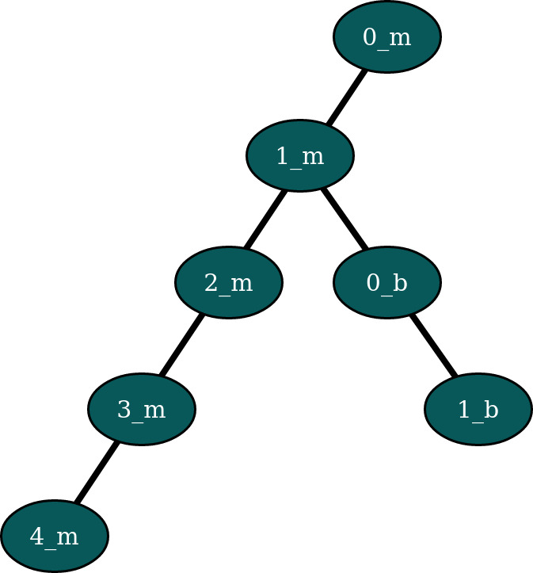
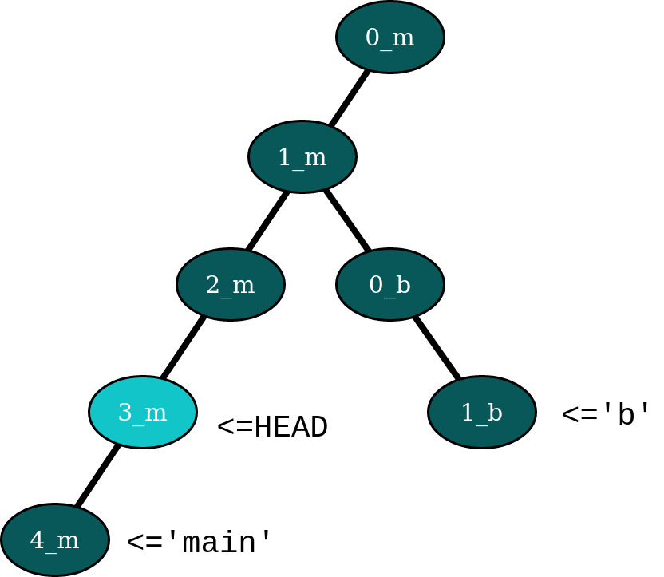
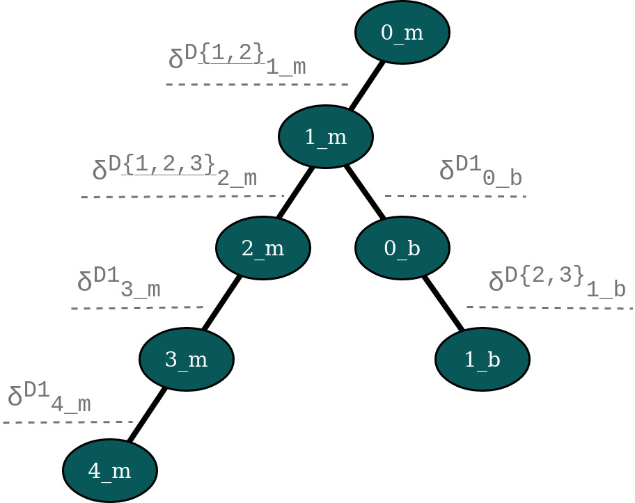
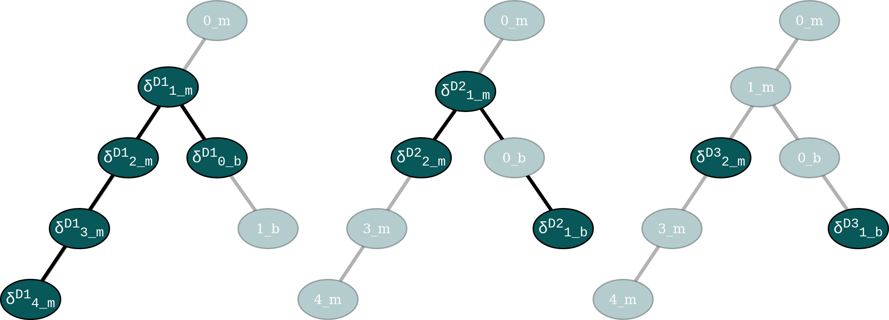
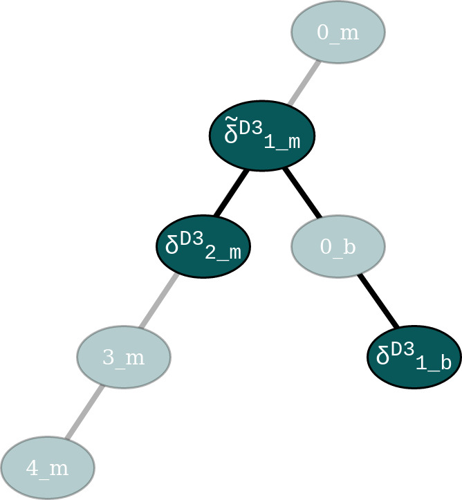
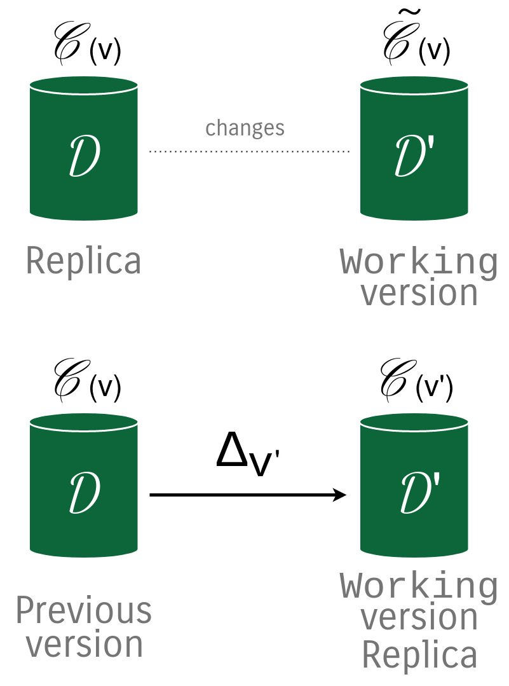

.. _versioning-system:

The Versioning System
=============================

After having an understanding of how the data needed for versioning is stored
into the helper collections, we can go one level higher and look at the
versioning system uses that data to perform the supported versioning operations.
We will analyse the data structures built from the data stored in the auxiliary
collections and illustrate with examples how they interact with the main
tracked collection.

The Version Tree
------------------
The main concept behind this library is the version tree.
This is not an actual data structure, and it is not physically implemented by
any class or collection, but the version tree is the combination between the
log tree and the set of per-document delta trees. We will proceed in explaining
its components, since they have a direct correspondence in the tracking
collections we have already seen in the previous section, and then we will
come back to it. The only two points to remember so far are:

    *  The version tree has the same nodes as the log tree
    *  The edges of the version tree are the sets of deltas that need to be
       applied in between versions (nodes) to transform some or all of the
       documents of the collection.

.. _log-tree:

    A log tree of a collection with two branches.

Before doing that, let us create a new database with structure presented in
:numref:`log-tree`, and consider that the collection has three documents:

    *  :math:`\mathcal D_1` that is modified in each version of the collection,
       except in :math:`\texttt{1\_b}`
    *  :math:`\mathcal D_2`, that is inserted in :math:`\texttt{1\_m}`, and
       modified in :math:`\texttt{2\_m}` and in :math:`\texttt{1\_b}`
    *  :math:`\mathcal D_3` that was inserted once in :math:`\texttt{2\_m}` on
       the ``main`` branch and once in :math:`\texttt{1\_b}`, on the ``b``
       branch.

As a notation, the tags :math:`\texttt{0\_m}`, :math:`\texttt{1\_b}`, etc,
written inside of each node represent a quicker way of referring to the
versions ``(0, 'main')``, ``(1, 'b')`` and so on.

Consider that each document contains a single field ``'v'`` that is initially
set to one and the it is incremented each time the document is modified. This
setup can be reproduced using the following piece of code:

.. code-block:: python

    from versioned_collection import VersionedCollection
    from pymongo import MongoClient
    from bson.objectid import ObjectId

    client = MongoClient("mongodb://localhost:27017")
    db = client['versioned_collection_test']

    def setup_database(database, collection_name):

        collection = VersionedCollection(db, collection_name)

        DOCUMENT1 = dict()
        DOCUMENT2 = dict()
        DOCUMENT3 = dict()

        def _increase_v_and_update(doc):
            doc['v'] += 1
            collection.find_one_and_replace(
                {'_id': doc['_id']}, doc
            )

        DOCUMENT1['v'] = 1
        DOCUMENT2['v'] = 1
        DOCUMENT3['v'] = 1

        collection.insert_one(DOCUMENT1)
        collection.init("0_m")

        _increase_v_and_update(DOCUMENT1)
        collection.insert_one(DOCUMENT2)
        collection.register("1_m")

        _increase_v_and_update(DOCUMENT1)
        _increase_v_and_update(DOCUMENT2)
        collection.insert_one(DOCUMENT3)
        collection.register("2_m")

        for i in range(2, 5):
            _increase_v_and_update(DOCUMENT1)
            collection.register(f"{i}_m")

        collection.checkout(1, 'main')
        _increase_v_and_update(DOCUMENT1)
        collection.register('0_b', 'b')

        _increase_v_and_update(DOCUMENT2)
        _increase_v_and_update(DOCUMENT3)
        collection.register("1_b")

        collection.checkout(4, 'main')
        return collection

    collection = setup_database(db, 'versioning')

We will use this setup to explain the concepts of log tree and delta trees in
the following subsections.

    `source <https://imgflip.com/i/nwpud>`_

The Log Tree
+++++++++++++++
The Log Tree (see :numref:`log-tree`) stores the log or history of versions,
each branch of the tree representing a versioning branch, therefore the log
tree can be seen as a tree  describing how the versions of the target
collection have evolved in time. Each node of the tree corresponds to a
registered version and is identified by the name of the branch on which it
is located and the version ID for that branch. When a new branch is created,
the version of the first node on that
branch will be ``0``.

.. _log-tree-branches:

    Branches as pointers to versions of the log tree.

In ``versioned_collection`` branches are pointers to the version nodes of the
log tree, as shown in :numref:`log-tree-branches`. Here, we are checked out at
version :math:`\texttt{3\_m}` (remember that this is just notation for
``(3, 'main')``), so the ``HEAD`` pointer, represented by the metadata
collection points to that version, the ``'main'`` branch pointer points to the
latest version on the ``'main'`` branch and the ``'b'`` branch pointer
points to the latest version on the ``'b'`` branch. Each time a new version
is added on a branch, the branch pointers will advance to point to the newly
added version, and similarly when versions are removed.

Version registration is an atomic operation, so
there can be a single operation that registers a new version running at any
time. This means that the versions represented by the nodes are a partially
ordered set. This makes sense since we've seen that the versions can be
organised in the log tree, and the tree induces a partial order on its set of
nodes.

Let :math:`\mathcal V` be the set of all versions registered. The set
:math:`\mathcal V` can be seen as the nodes of the log tree :math:`\mathcal L`
(or the nodes of the version tree since they have the same nodes). Formally,
:math:`\mathcal L` is a collection of (finite) sequences of elements of
:math:`\mathcal V` in the form :math:`\langle v_0, v_1, \dots , v_n \rangle`
such that :math:`v_0 < v, \forall v \in \mathcal V \setminus \ \{v\}` and each
:math:`v_n` is a version to which a branch pointer is pointing. Moreover, we
have the property that if we have a sequence of length :math:`n`
:math:`\langle v_0, v_1, \dots , v_{n-1} \rangle \in \mathcal L` and if
:math:`0 \leq m < n`, then the truncated sequence
:math:`\langle v_0, v_1, \dots , v_{m-1} \rangle` also belongs to
:math:`\mathcal L`.

Based on the ordering property of nodes of the log tree, we now define four
related operations:

The first operation we define is the predecessor, denoted by :math:`pred`:

.. math::

    \begin{gather*}
    pred : \mathcal V \rightarrow \texttt{Set(} \mathcal V \texttt{)} \\
    pred(v) = \{s \in \mathcal L \setminus \{v\} \mid s[-1] = v \}
    \end{gather*}

, which takes a version in :math:`\mathcal V` and returns the set of versions
that were registered before (on the path to the root of the tree).

Similarly, we define the successor operation:

.. math::

    \begin{gather*}
    succ : \mathcal V \rightarrow \texttt{Set(} \mathcal V \texttt{)} \\
    succ(v) = \bigcup_{v' \in \mathcal V} pred(v') \setminus pred(v) \
        \text{ s.t. } \forall s \in \mathcal L, s[-1] = v' \wedge v \in s
    \end{gather*}

This simply means that the predecessors of a version node are all versions
registered in the log tree on the path from the given version to the root of
the tree, and the successors of a version node are all node that are part of
the subtree of :math:`\mathcal L` rooted in the given version, excluding that
version.
For example, using the data in :numref:`log-tree-branches`, we have that
:math:`succ(\texttt{2\_m}) = \{ \texttt{3\_m}, \texttt{4\_m} \}` and
:math:`pred(\texttt{0\_b}) = \{ \texttt{1\_m}, \texttt{0\_m} \}`.

One useful notion from trees that automatically extends to log trees is the
idea of lowest common ancestor of two nodes in the tree. This can be written
as follows:

.. math::

    LCA(v_1, v_2) = \min_{v} \left ( v \in pred(v_1) \cap pred(v_2) \right )

Deltas and per-document Delta Trees
++++++++++++++++++++++++++++++++++++++++

The Deltas
^^^^^^^^^^^^^^^^^^^^^^^^^^^^^^^^^^^^^^^^

Deltas are documents of the ``__deltas_<target_collection_name>`` collection
that store the forward and backward differences between two versions of a
document.  For each edge of Version Tree, there exists a non empty set of Deltas,
that can be applied to some or all of the documents in the source version to
change the state of the collection to the target version.

We've seen previously that the documents `deltas` collection contain
the timestamp when the version for which the delta document was created,
therefore deltas corresponding to a document  of the collection form a `partial
order`. This is intuitive and easy to understand since deltas are strictly
linked with the nodes of the version tree, i.e., a delta transforms a
document to bring it into the state it should be for the version the delta
was registered.
Since the total delta tree of a document forms a tree, and the deltas are
partially ordered, then for each node ``n`` in the delta tree, it
is guaranteed that any successor node has a timestamp larger than the
timestamp of the node ``n``. This is a similar concept to the ordering notions
of version nodes in the log tree.

Before we move on, we will define some notation that will make easier to
understand the concepts around delta trees.

Let :math:`\mathscr C` be a versioned collection and let
:math:`\mathscr C(v)` be the state of the collection in version :math:`v \in
\mathcal V`.
Let :math:`\delta_{v | d}^{\mathcal D}` represent a delta object, where
:math:`\mathcal D \in \mathscr C(v), v \in \mathcal V` and :math:`d` is a
direction in time. This means that :math:`\delta_{v | d}^{\mathcal D}` is an
object that acts on a document and transforms it to reflect the state of the
collection at version :math:`v`.
Deltas behave differently when applied forward (advance in time, when
:math:`d = 1`) or backwards (go back in time, when :math:`d = -1`). By
default, we think of the version tree as a tree with the root up, and the
leaves down, so the default direction in time is forward.
We do that because deltas are objects that 'sit' between versions, for
example, if we have :math:`v, v' \in V` such that :math:`v' \in succ(v)` and
we have a two versions
:math:`\mathscr D \in \mathscr C(v), \mathscr D' \in \mathscr C(v')`
of the **same** document :math:`\mathcal D` then
:math:`\mathscr D + \delta_{v' | 1}^{\mathcal D} = \mathscr D'` and
:math:`\mathscr D' + \delta_{v' | -1}^{\mathcal D} = \mathscr D`. Notice that
the delta object remained the same, but only the direction of application
changed. Because of this we will usually omit the direction because it can be
deduced from the context, when we have a ordered delta tree for a document.

When defining a delta :math:`\delta_v^{\mathcal D}` we do not know what was
the previous version in which :math:`\mathcal D` existed, and we do not care,
as long as the deltas are applied in the correct order, from a valid state
of the versioned collection. This is reflected in the state of the `deltas`
collection, where each document only records the version for which the delta
was registered.

**Example**

Let's look again at the example set in :numref:`log-tree`. The deltas
registered by each ``register`` operation are presented in
:numref:`deltas-tree`. As a shorthand notation, we used
:math:`\delta_v^{\mathcal D\{1,2,...\}}`, for the versions
where deltas were registered for multiple documents, so we have as many
deltas as the numbers in the curly braces (one for each modified document).
The first thing we notice is that deltas sit in between the
nodes of version tree, so they represent the transitions that need to be
applied to specific documents in the collection to change their state (and
the state of the collection implicitly, since a collection is made out of
documents).

.. _deltas-tree:

    The deltas that modify the documents between two collection versions,
    displayed on the version tree.

Document Delta Trees
^^^^^^^^^^^^^^^^^^^^^^^^^^^^^^^^^^^^^^^^

Now since we've briefly understood how deltas work, we can look at how deltas
registered for a document are related.
If we look at the deltas corresponding to a single document, we notice that they
form a tree structure. For instance, for document :math:`\mathcal D_1`, we
notice that it was modified in all versions in
:math:`succ(\texttt{0\_m}) \setminus \{ \texttt{1\_b} \}`. If we want to go
from version :math:`\texttt{0\_m}` to version :math:`\texttt{4\_m}`, we'll have
to iteratively apply the deltas registered for the ``'main'`` branch starting
with
:math:`\delta_{\texttt{1\_m}}^{\mathcal D_1}`, then apply
:math:`\delta_{\texttt{2\_m}}^{\mathcal D_1}` and so on up to (and including)
:math:`\delta_{\texttt{4\_m}}^{\mathcal D_1}`. Similarly, if we are at version
:math:`\texttt{0\_m}` and want to go to version :math:`\texttt{1\_b}`,
we'll have to apply
:math:`\delta_{\texttt{1\_m}}^{\mathcal D_1}`,
:math:`\delta_{\texttt{0\_b}}^{\mathcal D_1}` and
:math:`\delta_{\texttt{1\_b}}^{\mathcal D_1}` in order. We notice how this
induces a tree structure on the deltas, which we will call the document delta
tree or per-document delta tree, where the deltas, which are the transitions
between versions, become nodes.

.. _delta-tree-nodes:

    Delta trees for :math:`\mathcal D_1` (left) and :math:`\mathcal D_2`
    (middle) and :math:`\mathcal D_3` (right)

In addition to that, we observe how this document delta tree is `sparser`
than the log tree (see :numref:`delta-tree-nodes`).
For :math:`\mathcal D_1`, there is no delta between
versions  :math:`\texttt{0\_b}` and  :math:`\texttt{1\_b}`, and for
:math:`\mathcal D_3` we only have two deltas: one between :math:`\texttt{1\_m}`
and  :math:`\texttt{2\_m}` and the other one between  :math:`\texttt{0\_b}` and
:math:`\texttt{1\_b}`. These deltas are trees on their own (trees with a
single node), but they are not connected.
If :math:`\mathcal D_3` had been modified, for instance, between
:math:`\texttt{3\_m}` and  :math:`\texttt{4\_m}`, then a new delta
:math:`\delta_{\texttt{4\_m}}^{\mathcal D_3}` would have been
registered between those versions, and
:math:`\delta_{\texttt{2\_m}}^{\mathcal D_3}` and
:math:`\delta_{\texttt{4\_m}}^{\mathcal D_3}` would have formed a tree. Again
that tree would be sparser, since it `jumps over` version
:math:`\texttt{3\_m}`, meaning that the version of :math:`\mathcal D_3` in
:math:`\texttt{2\_m}` and  :math:`\texttt{3\_m}` stays the same and it is
modified only when the collection changes its state to :math:`\texttt{4\_m}`.

We know that all deltas
that modify a document can be grouped together by the identifier of the
document :math:`\mathcal D` that they modify and
denote this collection as :math:`\Delta^\mathcal D` which is defined as
follows:

.. math::

    \Delta^\mathcal D =
        \{ \delta_v^\mathcal D \mid \forall v \in \mathcal V \
        \text{ s.t. } \mathcal D \in \mathscr C(v)\}

Since the deltas can be ordered then we can construct the document delta
tree, or the per-document delta tree :math:`\widetilde{\Delta^\mathcal D}`
that groups the deltas in :math:`\Delta^\mathcal D` into a tree. In general,
the number of nodes of :math:`\widetilde{\Delta^\mathcal D}` may be larger
than the cardinality of :math:`\Delta^\mathcal D` and we will explain later
why this is the case.

We saw that deltas can be grouped by the document they modify, but there is
another useful way of doing this, and that is grouping them by the version
then were registered in. Let :math:`\Delta_v` represent the set of deltas
that need to be applied to the right documents to change the version of the
collection to version :math:`v`:

.. math::
    \Delta_v = \{ \delta_v^\mathcal D \mid \forall \mathcal D \in \mathscr C \
        \text{ s.t. } \mathcal D \in \mathscr C(v) \}

Note that :

.. math::

    \{\delta_v^\mathcal D\} = \Delta_v \cap \Delta^\mathcal D, \ \
        \forall v \in \mathcal V, \forall \mathcal D \in \mathscr C

As we did with the log tree nodes, we can define the notion predecessor and
successor set by overloading the :math:`prev` and :math:`succ` operators on
deltas:

.. math::
    \begin{gather*}
    pred : \mathcal \Delta^\mathcal D \rightarrow \
        \texttt{Set(} \mathcal \Delta^\mathcal D \texttt{)} \\
    pred(\delta_v^\mathcal D) =
        \{ \delta_{v'}^\mathcal D \in \Delta^\mathcal D \  \mid \
            \forall v' \in \mathcal V \text{ s.t. } v' \in pred(v) \} \\ \\
    succ : \mathcal \Delta^\mathcal D \rightarrow \
        \texttt{Set(} \mathcal \Delta^\mathcal D \texttt{)} \\
    succ(\delta_v^\mathcal D) =
        \{ \delta_{v'}^\mathcal D \in \Delta^\mathcal D \mid \
            \forall v' \in \mathcal V \text{ s.t. } v' \in succ(v) \}
    \end{gather*}

Note that in the above definitions we restrict the deltas added to the
returned sets to only those deltas that are part of :math:`\Delta^\mathcal
D`, since there may not exist a delta for all registered versions, for a
document. We've seed this above, when we said that delta trees are sparser
than the log trees.

Based on this operators, we define the notion of a delta tree rooted in
version :math:`v` as:

.. math::

    \Lambda_v^\mathcal D = \begin{cases}
        \{\delta_v^\mathcal D \} \cup \ succ(\delta_v^\mathcal D) & \
            \text{ if } \
            \exists \delta_v^\mathcal D \in \Delta^\mathcal D \text{ s.t. } \
            pred(\delta_v^\mathcal D) = \varnothing\\
        \texttt{undefined} & \text{ otherwise}
    \end{cases}

Even though :math:`\Lambda_v^\mathcal D` is just a set of deltas, we refer to
it as a tree, since the its elements can be structured as the nodes of a
tree.
Note that :math:`\Lambda_v^\mathcal D` always exists, since if there exist at
least one delta in :math:`\Delta^\mathcal D`, then we can build a delta tree
with it, otherwise the document was never modified. For example, looking at
:numref:`delta-tree-nodes`, :math:`\Lambda_v^{\mathcal D_1}` is the tree rooted
in :math:`\delta_{\texttt{1\_m}}^{\mathcal D_3}` that contains 5 nodes
including the root, and :math:`\Lambda_v^{\mathcal D_2}` is the tree rooted in
:math:`\delta_{\texttt{1\_m}}^{\mathcal D_2}` that has two children:
:math:`\delta_{\texttt{2\_m}}^{\mathcal D_2}` and
:math:`\delta_{\texttt{1\_b}}^{\mathcal D_2}`.

Unconnected Document Delta Trees
^^^^^^^^^^^^^^^^^^^^^^^^^^^^^^^^^^^^^^^^

In  :numref:`delta-tree-nodes` we placed the delta nodes on top of the
versions of the collection on which they were registered, but a better way
of thinking about deltas is shown in :numref:`deltas-tree`, since deltas
really belong in the the version tree. The reason why that way of visualising
delta trees is problematic since we know that all deltas of a document form a
tree, but the figure for :math:`\mathcal D_3` does not look like a tree since
the two deltas do not seem to be related, or in other words are unconnected.
The greyed out nodes that represent versions are added just for context, but
they give us a hint that version :math:`\texttt{1\_m}` somehow relates the deltas
:math:`\delta_{\texttt{2\_m}}^{\mathcal D_3}` and
:math:`\delta_{\texttt{1\_b}}^{\mathcal D_3}`.

We distinguish two situations that can happen when a delta is created for a
document in the collection:

  *  It's the first time the document is *ever* modified. This means that it
     is freshly added to the collection, or it was part of the initial
     state of the collection and now it's finally modified (in any way).
     Under this scenario, a delta is created the first time for that
     document, so it has no parent.
  *  The document was modified before, therefore there exists a delta
     registered for it, and the newly added delta is linked to the previous
     delta.

The links between deltas can be seen in the documents of the `deltas`
collection (fields ``next`` and ``prev``). Based on this, we define a new
operator :math:`prev` as follows:

.. math::

    \begin{gather*}
    prev : \Delta^\mathcal D \rightarrow \
        \Delta^\mathcal D \cup \{ \texttt{null} \} \\ \\
    prev(\delta_v^\mathcal D) =
        \begin{cases}
            \delta_{v'}^\mathcal D & \text{ where } \
                v' \in pred(v) \wedge \
                \delta_{v'}^\mathcal D \in \Delta^\mathcal D \wedge \
                dist(\delta_v^\mathcal D, \delta_{v'}^\mathcal D) = 1 \\
            \texttt{null} & \text{ otherwise }
        \end{cases}
    \end{gather*}

, where :math:`dist` is recursively defined as:

.. math::

    dist(\delta_v^\mathcal D, \delta_{v'}^\mathcal D) =
        \begin{cases}
            \infty & \text{if } \delta_v^\mathcal D \in \Lambda_v^\mathcal D, \
                \delta_{v'}^\mathcal D \in \Lambda_{v'}^\mathcal D, \
                \Lambda_v^\mathcal D \neq  \Lambda_{v'}^\mathcal D \\
            0 & \text{if } v = v' \\
            | pred(\delta_v^\mathcal D) \cap succ(\delta_{v'}^\mathcal D) | + 1
                & \text{if } v' \in pred(v) \\
            | pred(\delta_{v'}^\mathcal D) \cap succ(\delta_v^\mathcal D) | + 1
                & \text{if }  v \in pred(v') \\
            dist(\delta_v^\mathcal D, \delta_{\tilde v}^\mathcal D) + \
            dist(\delta_{v'}^\mathcal D, \delta_{\tilde v}^\mathcal D)
                & \text{otherwise, where } \tilde v = LCA(v,v')
        \end{cases}

The above definition for :math:`prev` is quite intuitive and says that the
previous delta of a given delta :math:`\delta_v^\mathcal D` is
:math:`\texttt{null}`, i.e., it  does not exist, if the given delta is the
root of a delta tree, or it is a delta in the set of document deltas, that
is applied immediately before to transform the document such that
:math:`\mathcal D \in \mathscr C(v)`.

We observe that the distance between two deltas is properly defined only for
deltas that are part of the same delta tree rooted in a common version that
precedes the two versions for which the argument deltas are registered.

    *  If the two versions are the same, then the deltas are the same, so the
       distance between them is 0.
    *  If the deltas are on the same tree branch (not versioning branch) then
       the distance between them is the number of deltas registered in
       between them (intuitive, right?).
    *  Otherwise the two deltas are registered on two different branches,
       therefore the distance between them is  the sum of distances between
       each delta and the lowest common ancestor of the versions
       of the two deltas.

Any deltas that have infinite distance between them are part of different
`unconnected document delta trees`. This type of object arises, the
unconnected delta tree, when the collection has
branches and the same object is added independently to the collection on both
branches, therefore two separate (root) deltas are registered for that document.

We have already seen this in :numref:`delta-tree-nodes`, for document
:math:`\mathcal D_3`. In this case we have two seemingly unrelated delta
trees rooted in :math:`\texttt{2\_m}`, i.e.,
:math:`\Lambda_{\texttt{2\_m}}^{\mathcal D_3}` and :math:`\texttt{1\_b}`, i.e.,
:math:`\Lambda_{\texttt{1\_b}}^{\mathcal D_3}`.
If we modify :math:`\mathcal D_3` again on either of the two existing
branches, the new created deltas will be added as the children of the
delta tree for that branch. This means that we can group the unconnected
delta trees into the set of all unconnected per-document delta trees:

.. math::

    \Lambda^\mathcal D = \{ \Lambda_v^\mathcal D \mid \forall v \in \mathcal V \
        \exists \delta_v^\mathcal D \in \Delta^\mathcal D \text{ s.t. } \
        prev(\delta_v^\mathcal D) = \texttt{null}  \}

The 'complete' per-document Delta Tree with unconnected components
^^^^^^^^^^^^^^^^^^^^^^^^^^^^^^^^^^^^^^^^^^^^^^^^^^^^^^^^^^^^^^^^^^^

When we talked about document delta trees, we said that for a document
:math:`\mathcal D` and from the set of deltas action on the document, which
we called :math:`\Delta^\mathcal D`, we can create a document delta tree
:math:`\widetilde {\Delta^\mathcal D}` that can have more nodes than elements
in :math:`\Delta^\mathcal D`. If :math:`| \Lambda^\mathcal D | = 1`, i.e., we
have a single document delta tree, then :math:`\widetilde {\Delta^\mathcal D}`
can be built only from the elements of :math:`\Delta^\mathcal D`, so we call
it complete. In fact the set :math:`\Delta^\mathcal D` is complete in the
sense that it contains all the necessary elements to build a delta tree for
document :math:`\mathcal D`.  If :math:`| \Lambda^\mathcal D | > 1`, then
:math:`\mathcal D` has at least two unconnected delta trees. Remember that we
want to create a single delta tree for :math:`\mathcal D`, so we can somehow
link the delta trees together. We can do that by creating a new tree, which
has an identity delta as the root, and the roots of each tree in
:math:`\Lambda^\mathcal D` will be connected as the new tree (as the children
of the identity delta). By doing that we can navigate between the leaves of
one of the trees to the leaves of the other delta tree, by going up to the
root of the first tree, stepping into the new root (the identity delta) and
the going down to the desired root. We define the identity delta
:math:`\tilde{\delta}_v^\mathcal D` as the delta with the following property:

.. math::

    \delta_{v | d}^\mathcal D + \tilde{\delta}_{v' | d' }^\mathcal D = \
    \tilde{\delta}_{v' | d'}^\mathcal D + \delta_{v | d}^\mathcal D = \
    \delta_{v | d}^\mathcal D, \quad \
        \forall v, v' \in \mathcal V, \
        \forall \delta_{v | d}^\mathcal D \in \Delta_v^\mathcal D, \
        \forall d \in \{1, -1\}

We now know what should the new root of the complete document delta tree
looks like, and that is should be the identity delta. The next question is
where should it placed into the version tree?

Delta objects are strictly linked to the versions of the version tree, since
a delta is a transition applied to a document to change it so that it aligns
with the state of the collection in that version (this is how we defined
deltas previously). Looking back at the example in
:numref:`delta-tree-nodes`, we see that :math:`\mathcal D_3` was modified in
versions :math:`\texttt{2\_m}` and :math:`\texttt{1\_b}`. Remember that we
overloaded the :math:`pred` and :math:`succ` operators for deltas and the way
we defined what deltas precede each delta is strictly related to the notion
of predecessor and successor of versions in the log tree :math:`\mathcal L`,
which is the intuitive notion of predecessor and successor sets on a tree.
Since we don't want to break those definitions and our way of ordering deltas
based on the nodes of :math:`\mathcal L`, where we put the new root of the
complete document delta tree matters. Therefore the new delta tree root should
be linked to the version that is the lowest common ancestor of the versions
for which the roots of the unconnected trees are registered.

.. _complete-delta-tree:

    The delta tree for document :math:`\mathcal D_3`

Using the example in :numref:`delta-tree-nodes`,
:numref:`complete-delta-tree` shows the complete delta tree
:math:`\widetilde {\Delta^{\mathcal D_3}}`, where
:math:`\texttt{1\_m} = LCA(\texttt{2\_m}, \texttt{1\_b})`. For completeness,
Algorithm 1 shows how to compute a complete document delta tree.

.. _algorithm-1:
.. pcode::
   :linenos:

    \begin{algorithm}
    \caption{Build a complete delta tree}
    \begin{algorithmic}
    \PROCEDURE{build-complete-delta-tree}{$\Lambda^\mathcal D$}
    \IF{$| \Lambda^\mathcal D | = 1$}
        \Return $\Lambda^\mathcal D$
    \ENDIF
    \WHILE{$| \Lambda^\mathcal D | > 1$}
        \STATE overlaps = []
        \STATE pairs = []
        \FOR{$ \Lambda_v^\mathcal D \in \Lambda^\mathcal D$ }
            \FOR{$ \Lambda_{v'}^\mathcal D \in \Lambda^\mathcal D $}
                \STATE overlaps.append($ | (prev(v) \cap pred(v') |$)
                \STATE pairs.append($v, v'$)
            \ENDFOR
        \ENDFOR
        \STATE i = \textbf{argmax} overlaps
        \STATE $v, v'$ = pairs[i]
        \STATE $\tilde v = LCA(v, v')$
        \STATE pop $\Lambda_{v'}^\mathcal D$ from $\Lambda^\mathcal D$
        \STATE pop $\Lambda_{v}^\mathcal D$ from $\Lambda^\mathcal D$
        \STATE $\Lambda_{\tilde v}^\mathcal D = \Lambda_{v}^\mathcal D \cup \Lambda_{v'}^\mathcal D \cup \{ \tilde{\delta}_{\tilde v}^\mathcal D \} $
        \STATE add $\Lambda_{\tilde v}^\mathcal D$ to $\Lambda^\mathcal D$
    \ENDWHILE
    \State $\widetilde{\Delta^\mathcal D} = \Lambda^\mathcal D$
    \Return $\widetilde{\Delta^\mathcal D}$
    \ENDPROCEDURE
    \end{algorithmic}
    \end{algorithm}

Now we have all the components needed to properly understand the Version Tree.
:numref:`delta-tree-nodes` shows the version tree for our toy example. Let
:math:`\mathscr C` pe the ``'versioning'`` collection, then:

    *  the nodes of tree are elements of :math:`\Delta^\mathcal D,\ \forall
       \mathcal D \in \mathscr C`, and
    *  each edge of the version tree that connects two adjacent versions
       :math:`v` and :math:`v'`, where :math:`v' < v`, is the set
       :math:`\Delta_v`.

We also understand that elements of  :math:`\Delta^\mathcal D` can be grouped
into a set of unconnected delta trees :math:`\Lambda^\mathcal D`, which can be
transformed into a complete document delta tree
:math:`\widetilde{\Delta^\mathcal D}`.

This concludes the more 'theoretical' part of this document.
There are several arguments why we included it in the tutorial in the first
place:

    *  It makes easier to explain how versioning works. We defined a set of
       notations that allow to quickly refer to elaborate concepts using just
       a few symbols.
    *  It provides complete picture of the data structures used in versioning,
       so it is an alternative way of analysing the code

Detecting changes and registering new versions
----------------------------------------------------
To detect and compute the changes of made to the target collection, we listen
and process the Change Streams to detect the modified documents. Those
documents are tagged as modified, and tracker documents are added to the
`modified` collection.

We have already seen this before in the section where we discussed the
structure of the tracking collections. The missing piece of the puzzle is how
to compute the changes, i.e, the deltas between the versions of the modified
documents.

The Replica Collection
+++++++++++++++++++++++
The Change Streams are a powerful concept, but they have certain limitations.
They are efficient and fast, but they do not offer full support for a
versioning application.
A change stream event linked to a document can return either the whole
updated/ modified document, or the changes made in the forward direction,
i.e., we get information about something inserted or deleted into a document,
but when a filed is updated we will only know the new value.

.. note::
    The above is true for MongoDB versions < 6.0. MongoDB 6.0 adds a
    ``fullDocumentBeforeChange`` field, which can be used to simplify the
    versioning algorithm. Instead of storing a whole replica collection, we
    can only have a partial replica, that contains only the modified
    documents. The tradeoff between fast queries and fast versioning will
    still exist.

This ``versioned_collection`` library stores only the changes made to a
document and not the whole document. For efficiency purposes, it needs a
mechanism of knowing the state of the collection before changes were made to it.
This is the purpose of the replica collection.

Registering a new version
++++++++++++++++++++++++++

At any given time, there are two versions of the target collection
:math:`\mathscr C` stored into the system: one as the `working` collection
(the original collection) and one as the `replica` collection.

.. _delta-register:

    Registering a new version :math:`v'` on the collection :math:`\mathscr C`
    after modifying the collection.

Suppose we are at version :math:`v` of collection :math:`\mathscr C` and
there are no changes. Then the replica and the working version of the collection
:math:`\mathscr C` i.e., :math:`\mathscr C(v)` will be the same. Suppose we
modify some documents and let's take a look at :numref:`delta-register`.
After the changes are made, the collection is in an intermediary state
:math:`\widetilde{\mathscr C}(v)`, and now the replica collection is in state
:math:`\mathscr C(v)`.

To register a version :math:`v'`, we want to do a couple of things:

    *  add a new node for :math:`v'` to :math:`\mathcal V`, which automatically
       adds a new sequence ending in :math:`v'` to :math:`\mathcal L`, which
       basically means that we extend the log tree, so we log a new version
       into the `logs` collection;
    *  store the the set of deltas :math:`\Delta_{v'}` into the `deltas`
       collection;
    *  update the `branches` collection in case the new version was
       registered on a new branch, or increase the version the branch tip is
       pointing to, if registered on the same branch;
    *  update the `metadata` collection;
    *  remove the tracker documents;
    *  create a new replica.

After registering the new version :math:`v'`, we notice (second row of
:numref:`delta-register`) that the `replica` collection becomes a copy of the
working collection (both being in state :math:`\mathscr C(v')`).

Navigating between versions
---------------------------------------------------

Navigating between versions, a.k.a checking out a version is another
fundamental operations in ``versioned_collection``. Let's look once again at
:numref:`delta-tree-nodes`, and suppose the current version is
:math:`v = \texttt{4\_m}` and we want to checkout version
:math:`v' = \texttt{1\_b}`. What we want to do is to traverse the version tree
between the two version, and each time we encounter an edge that connects
versions :math:`v_1` and :math:`v_2` we apply the corresponding deltas
:math:`\Delta_{\tilde v}` where :math:`\tilde v = v_1` if
:math:`v_1 \in pred(v_2)`, or :math:`\tilde v = v_2` if
:math:`v_2 \in pred(v_1)`.
Note that in the first case the
direction of the deltas that needs to be ``backward`` (or :math:`d=-1`) and in
the second case the direction should be ``forward`` (or :math:`d=1`).

Such a traversal of the version tree can be broken down in three steps:

    1.  Get the path between versions :math:`v` and :math:`v'`
    2.  Build the document delta tree and compose (merge) the deltas
        collected in the order of the traversal, for each document modified
        between the two version
    3.  Apply the 'merged' deltas to the corresponding documents of
        :math:`\mathscr C(v)` to get to :math:`\mathscr C(v')`

Getting the path between two versions
+++++++++++++++++++++++++++++++++++++++

Note that there are two possible cases that describe the relative
position of two versions :math:`v` and :math:`v'`:

    1.  :math:`v` and :math:`v'` are on the same branch in the version tree,
        i.e., :math:`\exists s \in \mathcal L \text{ s.t. } v \in s \
        \text{ and } v' \in s.`
    2.  :math:`v` and :math:`v'` are on different branches.

We can use the way the log tree :math:`\mathcal L` is defined to get the
sequences that contain the versions of interest to compute the path, but
there is a simpler way, that's also easily implementable, to achieve that,
which uses the already defined notion of lowest common ancestor.

Let :math:`\Pi_{v, v'}` be the (ordered) path between :math:`v` and :math:`v'`
which is defined as follows:

.. math::

    \begin{align*}
    v^* &= LCA(v,v') \\
    \Pi_{v, v'} &= \
        [(v, d)] + \
        path(v, v^*, d) + P\\
    P &= \begin{cases}
         [(v', d)] & \text{if } C \\
        [(v^*, -d)] + path(v^*, v', -d) + [(v', -d)] & \text{otherwise }
    \end{cases}\\
    C &= v \equiv v^* \vee v' \equiv v^*\\
    d &= 1 \text{ if } v \equiv v^* \text{ else } -1\\
    path(v_1, v_2, d) &= \begin{cases}
        sorted(succ(v_1) \cap pred(v_2), <) & \text{if } d = 1\\
        sorted(pred(v_1) \cap pred(v_2), >) & \text{if } d = -1
    \end{cases}\\
    \end{align*}

where :math:`sorted(S, op)` returns a list where
:math:`\forall i, j \leq |S|` if :math:`op(i, j)` then :math:`op(S[i], S[j])`.

This may seem a convoluted definition, but it has a simple implementation, if
we store the level of a node in the log tree. The root node has level 0, it's
direct children have level 1, their children have level 2 and so on. This
means associating each sequence in :math:`\mathcal L` with its length.

Based on this notion, the path between two versions and their lowest common
ancestor can be computed in the same time. Simply check the levels of the
nodes corresponding to the two versions: if they are not equal, go up in the
tree until the levels are equal, while keeping track of the traversed nodes.
If the levels are equal, check if the versions are equal (which means we were
in case 1, see above). If the version are not equal, the versions are on
different branches, so continue to go up until the levels are equal and then
stop. The version where we stopped is the LCA. Since we recorded the path
along the way, we just need to put it in the right order, by checking the
direction and the order of the nodes based on the position of the versions in
the tree.

Recovering the deltas to apply
+++++++++++++++++++++++++++++++++++++++

Using the path :math:`\Pi_{v, v'}` between versions :math:`v` and :math:`v'`
we can retrieve the set of deltas :math:`\Delta_{v^*}` for each version
:math:`v^*` in :math:`\Pi_{v,v'}`. We can then use all :math:`\Delta_{v^*}`
to create the document delta tree from which we extract the deltas.

Observe that since we already have a path between versions, we do not need to
build :math:`\Lambda^\mathcal D,\ \forall \mathcal D \in \mathscr C(v^*)`,
:math:`\forall v^* \in \Pi_{v, v'}`, because we only care about the parts of
the delta trees that overlap with our path. That being said, we can compute the
`partial` unconnected document delta tree rooted in a version :math:`v^*` that
contains a version :math:`v` as follows:

.. math::

    \Gamma_{v^*, \subset v}^\mathcal D = \left ( \Lambda_{v^*}^\mathcal D \
        \setminus \{ \delta_{v^*}^\mathcal D \} \right ) \cap \
        pred(\delta_v^\mathcal D) \cup \{\delta_v^\mathcal D\}

Having this object, to go from version :math:`v` to :math:`v'` on path
:math:`\Pi_{v, v'}`, we need to compute the partial trees rooted in the
lowest common ancestor of the two versions:

.. math::

    \widetilde{\Gamma_{\Pi_{v, v'}}^\mathcal D} = \
        \Gamma_{LCA(v, v'), \subset v}^\mathcal D \bigcup \
        \Gamma_{LCA(v, v'), \subset v'}^\mathcal D

and finally use :numref:`algorithm-1` to build the per document partial delta
tree:

.. math::

    \widetilde{\Delta^\mathcal D} = \
    \texttt{build-complete-delta-tree}(\widetilde{\Gamma_{\Pi_{v,v'}}^\mathcal D})

In the definition of :math:`\Gamma_{v^*, \subset v}^\mathcal D` we excluded
since we do not care about it, and it is replaced by the identity delta
:math:`\tilde{\delta}_{v^*}^\mathcal D` when the (partial) complete delta
tree is built.

:numref:`algorithm-2` shows the step needed to transform a document between
two versions :math:`v` to :math:`v'` after computing the path in the version
tree between versions.

.. _algorithm-2:
.. pcode:: 
   :linenos:

    \begin{algorithm}
    \caption{Compute the new version of a document during checkout}
    \begin{algorithmic}
    \PROCEDURE{transform-document}{$\mathcal D, \Pi_{v, v'}$}
        \STATE $v^* = LCA(v, v')$
        \STATE $\Gamma_{v^*, \subset v}^\mathcal D = \left ( \Lambda_{v^*}^\mathcal D \setminus \{ \delta_{v^*}^\mathcal D \} \right ) \cap pred(\delta_v^\mathcal D) \cup \{\delta_v^\mathcal D\}$
        \STATE $\Gamma_{v^*, \subset v'}^\mathcal D = \left ( \Lambda_{v^*}^\mathcal D \setminus \{ \delta_{v^*}^\mathcal D \} \right ) \cap pred(\delta_{v'}^\mathcal D) \cup \{\delta_{v'}^\mathcal D\}$
        \STATE $\widetilde{\Gamma_{\Pi_{v, v'}}^\mathcal D} = \Gamma_{v^*, \subset v}^\mathcal D \bigcup \Gamma_{v^*, \subset v'}^\mathcal D$
        \STATE $\widetilde{\Delta^\mathcal D} = \texttt{build-complete-delta-tree}(\widetilde{\Gamma_{\Pi_{v,v'}}^\mathcal D})$
        \STATE $\delta^* = \tilde{\delta}$
        \STATE $\tilde v = v$
        \WHILE{$\tilde v \neq v'$}
            \STATE $(\tilde v, d) = \Pi_{v, v'}[\tilde v]$
            \STATE $\delta^* = \delta^* + \delta_{\tilde v | d}^\mathcal D$
            \STATE $\tilde v = next(\widetilde{\Delta^\mathcal D}, \tilde v, d)$
        \ENDWHILE
        \Return $\mathcal D + \delta^*$
    \ENDPROCEDURE
    \end{algorithmic}
    \end{algorithm}

:numref:`algorithm-2` is computed for all necessary documents, and in the end,
the collection will have the correct state.

