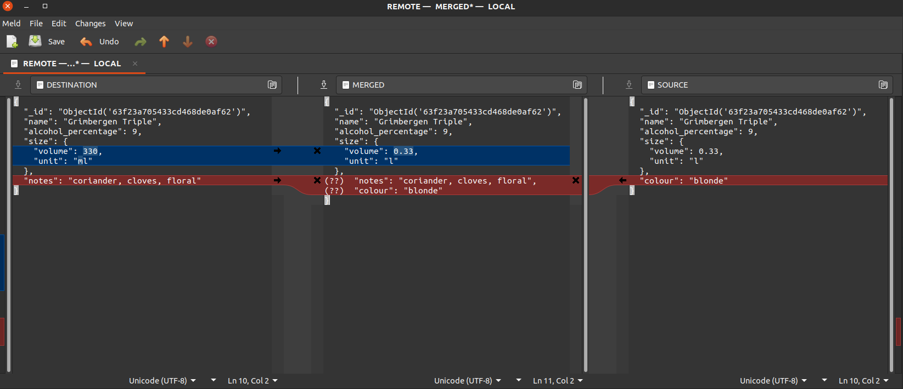

.. _basic-concepts:

Basic concepts
=======================================

.. currentmodule:: versioned_collection

This notebook provides a short introduction to VersionedCollection, which
allows versioning and tracking MongoDB collections in a git-like fashion.

This only shows the versioning from the perspective of a ``VersionedCollection``
object, ignoring the state of the auxiliary collections, which are considered
implementation details, and a regular user would not need to interact with
them directly. For more details about those, check the
:ref:`implementation-details-doc` document.

For information about how the versioning system works in more detail, check
:ref:`versioning-system`.

.. note::
    All the interactions with the collection should be done through the
    :class:`VersionedCollection` class, and not by directly accessing the
    collection using the ``pymongo`` driver. An exception to this is when the
    listener is started using the :ref:`CLI <command-line-interface>` via
    ``vc listen``.

.. warning::
        Note that outputting the result of an aggregation pipeline directly into
        the versioned collection using the ``$out`` or ``$merge`` stages will
        not track the changes. This is caused by how those commands are
        processed by MongoDB itself. For instance, ``$out`` creates a temporary
        collection, drops the original collection and then renames the
        temporary collection.

Setup
---------------------------------------

Let's start by setting up a database.

.. code-block:: python

    from versioned_collection import VersionedCollection
    from pymongo import MongoClient

    client = MongoClient("mongodb://localhost:27017")
    db = client['versioned_collection']
    beers_collection = VersionedCollection(database=db, name='beers')

``pymongo`` has a lazy collection creation, so no collection is created until we
try to use it. We can check that by inspecting the state of the database:

.. code-block:: python

    >>> list(db.list_collections())
    []

.. note::
    If access control is enabled, the user's credentials should be provided
    as well:

    .. code-block:: python

        host, port, user, password = get_params()

        client = pymongo.MongoClient(
            host=host,
            port=port,
            username=user,
            password=password,
        )

        db = client['database_name']
        bands_collection = VersionedCollection(db, 'bands', username=user, password=password)

Initialising a collection for tracking
---------------------------------------
We call a MongoDB collection `tracked` or `versioned` if it was initialised
for tracking by ``versioned_collection``. Initialising a collection means
creating the auxiliary tracking collections to record the current state of
the database, and listening to the collection to detect any changes that have
been made.

To initialise a versioned collection for tracking call ``init`` on collection and
optionally pass a message to help to remind ourselves the changes done to
the current version of the collection.

Before doing that we can check the status of the collection:

.. code-block:: python

    >>> beers_collection.status()
    {'tracked': False}

We can see that ``versioned_collection`` says that the collection is not tracked
or initialised for versioning yet.

.. code-block:: python

    >>> beers_collection.init(message='Empty collection')
    True

If we check again the state of the database we see a bunch of newly added
collections with a double underscore in front of their names. They are the
auxiliary collections used for versioning and should not be modified by the
user.

.. code-block:: python

    >>> db.list_collection_names()
    db.list_collection_names()
    ['__replica_beers',
     '__modified_beers',
     '__vc_lock',
     '__metadata_beers',
     '__deltas_beers',
     '__log_beers',
     '__branches_beers']

We can also inspect again the state of the collection to check its current
state:

.. code-block:: python

    >>> beers_collection.status()
    {'current_version': 0,
     'current_branch': 'main',
     'detached': False,
     'changed': False,
     'has_stash': False,
     'has_conflicts': False,
     '_id': ObjectId('63efb39c1fc11276e1412145')}

The first thing that we can see that the status of the collection is a
mongo document as well. It says that the current version of the collection
is ``0``, because we have just initialised it, the current (default) branch is
'main', there are no changes since the last registered version (the
collection is still empty) and the head pointer is attached. The collection
has no stashed changes and no conflicts. We'll explain these later.

Now let's insert some documents into the collection:

.. code-block:: python

    _beers = [('Duvel', 8.9), ('La Trappe Dubbel Trappist', 7)]
    for beer, alcohol in _beers:
        beers_collection.insert_one({'name':beer, 'alcohol_percentage': alcohol})

We can inspect the collection and see that the documents were indeed inserted:

.. code-block:: python

    >>> list(beers_collection.find({}))
    [{'_id': ObjectId('63efb43f1fc11276e1412147'),
      'name': 'Duvel',
      'alcohol_percentage': 8.9},
     {'_id': ObjectId('63efb43f1fc11276e1412148'),
      'name': 'La Trappe Dubbel Trappist',
      'alcohol_percentage': 7}]

Also we can inspect the state of the collection again:

.. code-block:: python

    >>> beers_collection.status()
    {'current_version': 0,
     'current_branch': 'main',
     'detached': False,
     'changed': True,
     'has_stash': False,
     'has_conflicts': False,
     '_id': ObjectId('63efb39c1fc11276e1412145')}

The ``'changed'`` attribute has changed its value to ``True``, because we
modified the collection and we have not registered the changes yet as a new
version.

Registering a version
---------------------------------------

Registering collection versions is similar to committing changes to a git
repository.

.. code-block:: python

    >>> beers_collection.register(message="Second version")
    True

We can check again the status of the collection. We can see that the version
number increased by 1. Also, since a new version was registered, there are no
untracked changes to the beers collection.

.. code-block:: python

    >>> beers_collection.status()
    {'current_version': 1,
     'current_branch': 'main',
     'detached': False,
     'changed': False,
     'has_stash': False,
     'has_conflicts': False,
     '_id': ObjectId('63efb39c1fc11276e1412145')}

Printing the log
--------------------------------------
The log shows information about the registered versions for a specific branch,
the latest versions being at top:

.. code-block:: python

    >>> for log_entry in beers_collection.get_log():
    ...     print(log_entry)
        *   version:   1
            branch:    main
            message:   Second version
            timestamp: 2023-02-17 17:09:50.647480

        *   version:   0
            branch:    main
            message:   Empty collection
            timestamp: 2023-02-17 17:04:28.156643

Changing versions
---------------------------------------
As with a git repository, we can navigate the version tree of a versioned
collection to switch to a specific recorded version. This will roll back the
state of the collection to the state at the moment the version was registered.

Let's modify a document in the collection:

.. code-block:: python

    >>> beers_collection.find_one_and_update(
    ...     filter={'name': 'Duvel'},
    ...     update={"$set" : {'alcohol_percentage': 8.5}})
    <pymongo.results.UpdateResult at 0x7fcd0b00f400>
    >>> list(beers_collection.find({}))
    [{'_id': ObjectId('63efb43f1fc11276e1412147'),
      'name': 'Duvel',
      'alcohol_percentage': 8.5},
     {'_id': ObjectId('63efb43f1fc11276e1412148'),
      'name': 'La Trappe Dubbel Trappist',
      'alcohol_percentage': 7}]

We can see that we updated the ``'alcohol_percentage'`` field of the
document with name ``'Duvel'`` has been updated. Let's register the change.

.. code-block:: python

    >>> beers_collection.register('Fixed alcohol percentage')
    True

Now there is a new version in the version tree and in the log tree:

.. code-block:: python

    >>> for log_entry in beers_collection.get_log():
    ...     print(log_entry)
        *   version:   2
            branch:    main
            message:   Fixed alcohol percentage
            timestamp: 2023-02-17 17:09:59.223003

        *   version:   1
            branch:    main
            message:   Second version
            timestamp: 2023-02-17 17:09:50.647480

        *   version:   0
            branch:    main
            message:   Empty collection
            timestamp: 2023-02-17 17:04:28.156643

Let's go back to version ``0`` where there were no documents. We can
use the ``checkout`` command and the number of the version we want to checkout:

.. code-block:: python

    >>> beers_collection.checkout(0)
    True

Now, if we inspect the status and the contents of the beers collection we get
the following:

.. code-block:: python

    >>> beers_collection.status()
    {'current_version': 0,
     'current_branch': 'main',
     'detached': True,
     'changed': False,
     'has_stash': False,
     'has_conflicts': False,
     '_id': ObjectId('63efb39c1fc11276e1412145')}
    >>> beers_collection.count_documents({})
    0

We see that the collection is empty as expected for version ``0`` and that
the status contains ``'detached': True``, meaning that we are in detached head
mode (just like in git). This means that we are not checked out to version on
the tip of a branch, i.e., the latest version on that branch.

If we run ``checkout(2)`` we can go back to the latest version of the
collection.

.. code-block:: python

    >>> beers_collection.checkout(2)
    True
    >>> beers_collection.status()
    {'current_version': 2,
     'current_branch': 'main',
     'detached': False,
     'changed': False,
     'has_stash': False,
     'has_conflicts': False,
     '_id': ObjectId('63efb39c1fc11276e1412145')}

Now the collection has again 2 documents, which match the ones registered at
this version:

.. code-block:: python

    >>> beers_collection.count_documents({})
    2
    >>> list(beers_collection.find({}))
    [{'_id': ObjectId('63efb43f1fc11276e1412148'),
      'name': 'La Trappe Dubbel Trappist',
      'alcohol_percentage': 7},
     {'_id': ObjectId('63efb43f1fc11276e1412147'),
      'name': 'Duvel',
      'alcohol_percentage': 8.5}]

An alternative in this case, since we wanted to go back to the last version on
the ``'main'`` branch would be to call:

.. code-block:: python

    >>> beers_collection.checkout(branch='main')
    True

In this case, since we were already at version ``(2, 'main')``, calling
``checkout`` does nothing.

Branching
---------------------------------------
Branching works similarly to how git branches work, but with reduced
functionality. Branches in ``versioned_collection`` do not support merging or
rebasing specific versions at the moment, since we did not encounter a case
when they are useful for our purposes. The only allowed operation on branches
are creating a branch, registering versions on it and checking out
different collection versions on it.

Let's check out to version ``0`` of the collection. We can create a separate
branch and modify the collection on this new branch.

.. code-block:: python

    >>> beers_collection.checkout(0)
    True
    >>> beers_collection.create_branch('branch')
    (0, 'main')

The ``create_branch`` operations returns the version of the branching node,
so the parent version of the next registered version on branch ``'branch'``.

Checking the current collection version and branch we learn the following:

.. code-block:: python

    >>> beers_collection.is_detached()
    False
    >>> beers_collection.version, beers_collection.branch
    (-1, 'branch')

First of all, the collection is not in detached head mode, since the current
state of the collection matched the state on the branch ``'branch'``. Then,
we observe that the current version of the collection is ``-1``. This may
seem peculiar, but it makes sense since there are no versions registered on
the ``'branch'`` branch yet, i.e., it is empty.

Let's insert a new document to the collection:

.. code-block:: python

    >>> beers_collection.insert_one({
    ...     'name': 'BOURGOGNE DES FLANDRES',
    ...     'alcohol_percentage': 5,
    ...     'size': {'volume': 33, 'unit': 'cl'}
    ... })
    <pymongo.results.InsertOneResult at 0x7f21b4758bc0>

Let's register a new version:

.. code-block:: python

    >>> beers_collection.register('Another branch with other beers')
    True
    >>> beers_collection.status()
    {'current_version': 0,
     'current_branch': 'branch',
     'detached': False,
     'changed': False,
     'has_stash': False,
     'has_conflicts': False,
     '_id': ObjectId('63efb39c1fc11276e1412145')}

We observe that now since we have a version registered on the branch, its
version number has been incremented from ``-1`` to ``0``.

Checking the log returns the following information:

.. code-block:: python

    >>> for log_entry in beers_collection.get_log():
    ...     print(log_entry)
        *   version:   0
            branch:    branch
            message:   Another branch with other beers
            timestamp: 2023-02-17 17:10:23.865352

        *   version:   0
            branch:    main
            message:   Empty collection
            timestamp: 2023-02-17 17:04:28.156643

We notice that the log also includes an entry for the version registered at
the root of the version tree (the first version registered). This is because
the logs are printed along the path on the version tree from the current
version to the root of the tree.

We can checkout between branches by passing the branch name as an argument to
``checkout``:

.. code-block:: python

    >>> beers_collection.checkout(branch='main')
    True
    >>> beers.collection.status()
    {'current_version': 2,
     'current_branch': 'main',
     'detached': False,
     'changed': False,
     'has_stash': False,
     'has_conflicts': False,
     '_id': ObjectId('63efb39c1fc11276e1412145')}

What we've seen so far is the explicit way of creating branches, but there is
an implicit way as well, that works only when the collection is in detached
mode.

Firstly, we have to checkout a version that is not on the tip of the
branch and then we have modify the collection in some way. Let's insert
document again:

.. code-block:: python

    >>> beers_collection.checkout(1)
    True
    >>> beers_collection.insert_one({
    ...     'name': 'BOURGOGNE DES FLANDRES',
    ...     'alcohol_percentage': 5,
    ...     'size': {'volume': 33, 'unit': 'cl'}
    ... })
    <pymongo.results.InsertOneResult at 0x7f21b4758ea78>

We can implicitly create a branch by calling ``register`` and passing the
name of the new branch.

.. code-block:: python

    >>> beers_collection.register('Implicit branch', branch_name='temp')
    True
    >>> beers_collection.version, beers_collection.branch
    (0, 'temp')

Deleting versions
---------------------------------------
When we delete a version, we the whole version subtree rooted in that version
is deleted. There are two possible cases:

    * we delete a version that is part of the current history
    * we delete a version that is not part of the current history

We currently are at version ``(0, 'temp')``. Let's delete
it:

.. code-block:: python

    >>> beers_collection.version, beers_collection.branch
    (0, 'temp')
    >>> beers_collection.delete_version_subtree(0, 'temp')
    True
    >>> beers_collection.version, beers_collection.branch
    (1, 'main')
    >>> beers_collection.is_detached()
    True
    >>> beers_collection.branches()
    {'branch', 'main'}
    >>> beers_collection.checkout(branch='main')
    True

If we had had any other branches or versions registered on the ``'temp'``
branch, they would have been deleted as well.

Diff
---------------------------------------

One useful feature when modifying a collection is to check the current
changes we've made since the last time we registered a version, or even to
check the differences between the current version and another version.

For that, we can use the ``diff`` command. Let's compute the differences
between version ``(1, 'main')`` and the current version ``(2, 'main')``.
We'll first define a short function to parse and print the diffs and then
display them:

.. code-block:: python

    def print_diffs(diffs):
         for doc_id, diff_str in diffs.items():
            print((f"Document {doc_id}\n{diff_str}\n"))

.. code-block:: python

    >>> diffs = beers_collection.diff(1, 'main')
    >>> print_diffs(diffs)

.. code-block:: diff

    Document ObjectId('63efd454813db2f1d5e34489')
    ---
    +++
    @@ -1,5 +1,5 @@
     {
       "_id": "ObjectId('63efd454813db2f1d5e34489')",
       "name": "Duvel",
    -  "alcohol_percentage": 8.9
    +  "alcohol_percentage": 8.5
     }

Note that the differences are from the version we passed ``(1, 'main')`` to
the current version.

Let's add a new document, and get the diff between the current state of the
collection (having unregistered changes) to the latest registered version
(which in this case will be ``(2, 'main')``, since we are checked out at that
version):

.. code-block:: python

    >>> beers_collection.insert_one({
    ...     'name': 'Grimbergen Triple',
    ...     'alcohol_percentage': 9,
    ...     'size': {'volume': 33, 'unit': 'cl'}
    ... })
    >>> diffs = beers_collection.diff()
    >>> print_diffs(diffs)

which prints

.. code-block:: diff

    Document ObjectId('63efde28813db2f1d5e34493')
    ---
    +++
    @@ -1 +1,9 @@
    -{}
    +{
    +  "_id": "ObjectId('63efde28813db2f1d5e34493')",
    +  "name": "Grimbergen Triple",
    +  "alcohol_percentage": 9,
    +  "size": {
    +    "volume": 33,
    +    "unit": "cl"
    +  }
    +}

Discard changes
---------------------------------------

If we modified the collection accidentally, or simply we do not care about
the changes we've made, we can discard them and bring the collection back to
the state it was in the last registered version. To do that, we can use the
``discard_changes`` operation:

.. code-block:: python

    >>> beers_collection.has_changes()
    True
    >>> beers_collection.discard_changes()
    True
    >>> beers_collection.diff()
    {}
    >>> beers_collection.has_changes()
    False

Stash (stash, apply, discard)
---------------------------------------

Suppose we want are in a similar situations as before, where we have some
documents that are modified, or freshly inserted into the collection, and we
want to clear the changes, but this time only temporarily, and then reapply
them to the collection. In this situation, we can safely temporarily store
(or stash) the changes using the ``stash command``.

.. code-block:: python

    >>> beers_collection.insert_one({
    ...     'name': 'Grimbergen Triple',
    ...     'alcohol_percentage': 9,
    ...     'size': {'volume': 33, 'unit': 'cl'}
    ... })
    >>> beers_collection.has_changes()
    True
    >>> beers_collection.stash()
    True
    >>> beers_collection.has_changes()
    False
    >>> beers_collection.has_stash()
    True

We can now interact with the collection, possibly register a new version, or
we can checkout a previous version:

.. code-block:: python

    >>> beers_collection.checkout(1)
    True
    >>> beers_collection.stash_apply()
    True
    >>> beers_collection.has_stash()
    False
    >>> beers_collection.has_changes()
    True
    >>> beers_collection.is_detached()
    True

In the example above we stashed the newly inserted document, moved to version
``(1, 'main')`` and then applied the changes.

.. warning::
    Applying the stashed data overwrites any documents having the same IDs as
    the stashed documents.

If we realise that we do not care anymore about the stashed data, we can
discard it by using ``stash_discard``:

.. code-block:: python

    >>> beers_collection.insert_one({'name': 'dummy'})
    >>> beers_collection.stash()
    True
    >>> beers_collection.stash_discard()
    True
    >>> beers_collection.has_stash()
    False
    >>> beers_collection.has_changes()
    False

Note that calling ``stash_discard`` after ``stash`` has a similar effect as
calling ``discard_changes``.

Pull and Push
---------------------------------------
``versioned_collections`` allows data transfers between two collections that
hold the same data, by pulling or pushing versions from one to the other. We
can think of collections as it repositories: one of the collection will be
the `local collection` (the local repository), the other collection will be
treated as a `remote collection` (the remote repository).

In ``versioned_collection`` the distinction between the local and remote
collection is fuzzier, and the roles of the two can be changed, depending
which one we want to treat as local, and which one as remote, the distinction
being only in the semantics of `pushing` or `pulling` the data.

Let's start by creating a 'remote' database and a remote collection, having
the same name as the ``beers_collection``:

.. code-block:: python

    remote_db = client['versioned_collection_remote']
    local = beers_collection
    remote = VersionedCollection(remote_db, 'beers')

We also created an alias for the ``beers_collection`` as ``local``. Notice
that the `remote` database is a MongoDB database, different from the `local`,
but it can be located anywhere, so it can be on the same server, or on a
remote server, to which the mongo client will have to connect to.

.. note::
    We cannot treat the same database as both local and remote, because the
    local and remote versioned collections are required to have the same
    name, therefore they cannot coexist in the same database.

To transfer the current data of the local collection (both the documents of the
``'beers'`` collection and the versioning data) to the remote collection, we
use the ``push`` method on the local collection:

.. code-block:: python

    >>> local.push(remote)
    True

We can check the status and the log of the remote collection and see they are
identical to the status and history of the local collection:

.. code-block:: python

    >>> remote.status()
    {'current_version': 2,
     'current_branch': 'main',
     'detached': False,
     'changed': False,
     'has_stash': False,
     'has_conflicts': False,
     '_id': ObjectId('63f235bb5433cd468de0af5f')}
    >>> for log_entry in remote.get_log():
    ...     print(log_entry)
        *   version:   2
            branch:    main
            message:   Fixed alcohol percentage
            timestamp: 2023-02-17 19:24:09.750000

        *   version:   1
            branch:    main
            message:   Second version
            timestamp: 2023-02-17 19:24:06.943000

        *   version:   0
            branch:    main
            message:   Empty collection
            timestamp: 2023-02-17 19:24:02.060000

If we look at the signature of the ``push`` method we notice that it accepts
also a ``'branch'`` argument. This means that when synchronising the local
and remote collections we only transfer data from a (whole) branch, but not
the child branches.

We can see this by inspecting the branches of the two collections:

.. code-block:: python

    >>> local.branches()
    {'branch', 'main'}
    >>> remote.branches()
    {'main}

We can therefore also push the other branch of the local collection to the
remote:

.. code-block:: python

    >>> local.push(remote, branch='branch')
    True
    >>> remote.branches()
    {'branch', 'main'}

The opposite of ``push`` is ``pull``, which allows to get data from a remote
collection to a local collection. Let's create a new version on the remote
collection and then pull the version from the remote to the local collection:

.. code-block:: python

    >>> remote.insert_one({
    ...     'name': 'Grimbergen Triple',
    ...     'alcohol_percentage': 9,
    ...     'size': {'volume': 33, 'unit': 'cl'}
    ... })
    <pymongo.results.InsertOneResult at 0x7f4c29e5d980>
    >>> remote.register('Added grimbergen.')
    True
    >>> local.pull(remote, branch='main')
    True
    >>> local.version, local.branch
    (3, 'main')
    >>> local.get_log()[0].message
    'Added grimbergen.'

We see that we have successfully pulled the new version from the remote to
the local collection.

Note that instead of pulling the data from the remote collection locally, we
could have pushed it from the remote to the local collection.

The difference between ``versioned_collection`` collections and git
repositories is that you can directly modify either of them, since they are
just MongoDB collections. This library only offers a set of operations used
to version MongoDB collections, but the user can decide how they see fit to
use them. However it is recommended to treat the remote collection as if it
is locked in stone, and the only way to update it is to push data from a
local collection to it.

Resolving conflicts
---------------------------------------

When pulling data from the remote we may get into the situation where the
some documents were modified on both the local and the remote collections and
there are conflicting changes between the two versions. There are several
scenarios in which this may happen and generally, there are multiple ways of
solving this, but in some cases it may be easier to accept the conflicting
documents and manually resolve the conflicts.

``versioned_collection`` has a way of detecting assisting in the conflict
resolutions process. It firstly tries to merge documents modified in both
collections by automatically merging the fields of the document modified only
in one version, and in the situation when a field was modified in both
versions, it records the conflict and asks for resolution.

Let's try to deliberately create a conflict.

.. code-block:: python

    >>> local.update_one(
    ...     filter={'name': 'Grimbergen Triple'},
    ...     update={"$set": {
    ...         'colour': 'blonde',
    ...         'size.volume': 0.33,
    ...         'size.unit': 'l'}}
    ... )
    >>> remote.update_one(
    ...     filter={'name': 'Grimbergen Triple'},
    ...     update={"$set": {
    ...         'notes': 'coriander, cloves, floral',
    ...         'size.volume': 330,
    ...         'size.unit': 'ml'}}
    ... )
    >>> local.register('conflict')
    True
    >>> remote.register('conflict')

We've updated the same document from both collections to add a new field and
modify some values of the same field. The data under ``'size'`` will generate
a conflict:

.. code-block:: python

    >>> from versioned_collections.errors import AutoMergeFailedError
    >>> try:
    ...     local.pull(remote)
    ... except AutoMergeFailedError as e:
    ...     print(f'AutoMergeFailedError: {e}')
    AutoMergeFailedError: Automatic merge failed. Fix conflicts for branch main and then register a new version. For manually solving conflicts call `resolve_conflicts()`

The error message suggests to run ``resolve_conflicts``, so let's do that:

.. warning::
    Resolving the conflicts using ``resolve_conflicts()`` requires a to
    display data on screen, so make sure you resolve the conflicts on a local
    server having working graphics.

.. code-block:: python

    >>> local.resolve_conflicts()
    [vc] Resolved conflict for document 63f23a705433cd468de0af62
    True

After running the command a new window pops up just like in
:ref:`meld-gui-beer`. The middle column is the result for the merged
document, 'source' represents the local changes and 'destination' the remote
changes. Use the graphics interface to edit the document and then save the
changes and close the Meld window.

.. _meld-gui-beer:

    The Meld Merge Tool GUI used to resolve the conflicts.

After the conflicts are resolved, we have to register a new version:

.. code-block:: python

    >>> local.register("Fixed conflicts.")
    True
    >>> local.version, local.branch
    (5, 'main')

Now we have two options. We can directly push the latest version to the
remote collection, in which case the history of the two collections will not
be the same (since version 4 contains partial data from both collection), or
delete the version that generated the conflict from the remote and pushing
versions the last two versions from local (which still is an incomplete
picture, but the two collection will have the same history and data for
version ``4``):

.. code-block:: python

    >>> remote.delete_version_subtree(4, 'main')
    True
    >>> local.push(remote)
    True
    >>> remote.version, remote.branch
    (5, 'main')

